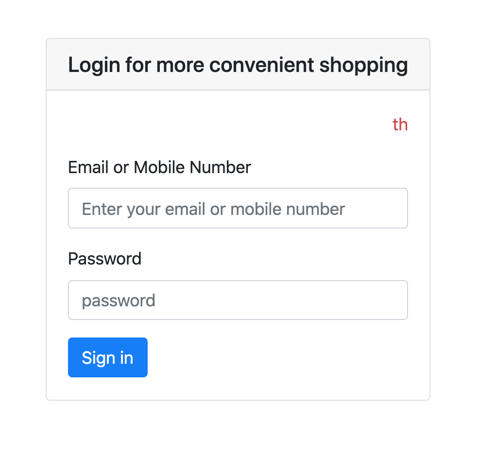
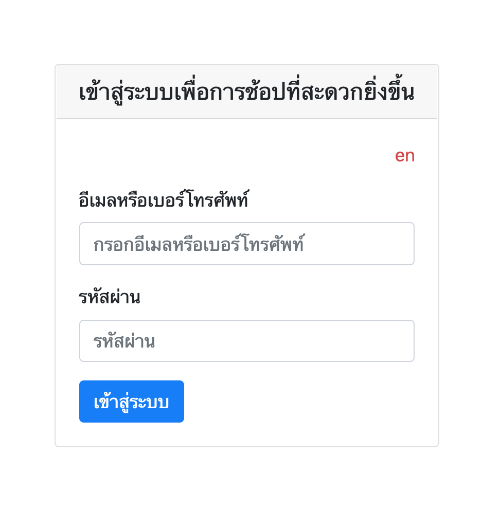
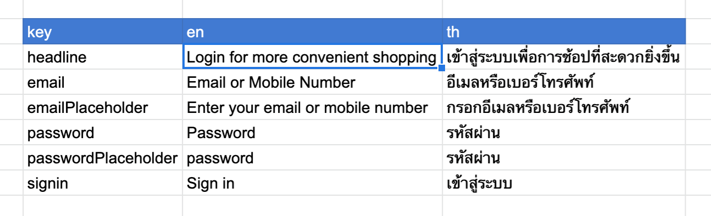

# I18next and Google Sheets API

Experiment to leverage Google Sheets collaboration and api capability to support translation in express app using i18next


### User interface





Blog: [link]

### Start

Clone the project and start with following

```sh
yarn

cp keys.example.json keys.json
cp .env.example .env
```

### Authentication requirements

Make sure Google Sheets API is enabled in `https://console.developers.google.com/` and you have created a service account for it under `credentials` section. After this, you should be able create new key under `keys` section of service account. Download as `keys.json` and update as per `keys.example.json` in project.

### Data requirements

You will have to create a new google spreadsheet and add sample data for translations as shown below:



After adding above, you should update `.env` file variables for spreadsheet id and rows where data can be found. See `.env.example`!

### Environment variables

You can disable google api while developing using `GOOGLE_API_ENABLED`. This will make use of `Mock` locale service to show data for form

Modify `APP_HOST` and `APP_PORT` as per convenience

### Commands available

*Start application on port specified in .env*

`yarn start` 

*Run tests*

`yarn test`


### To Try

You can update translations in google sheets to view the changes reflected in form without restarting the app after `reloadInterval` of 60 minutes.

To manually refresh the translations, visit `/reload-locales` and view form to see the reflected change.
